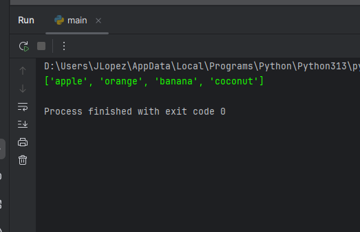
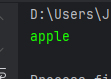
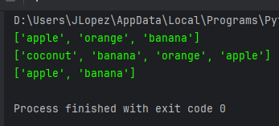
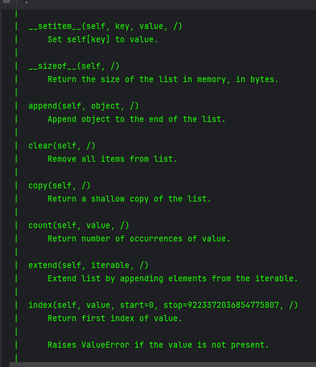
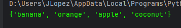
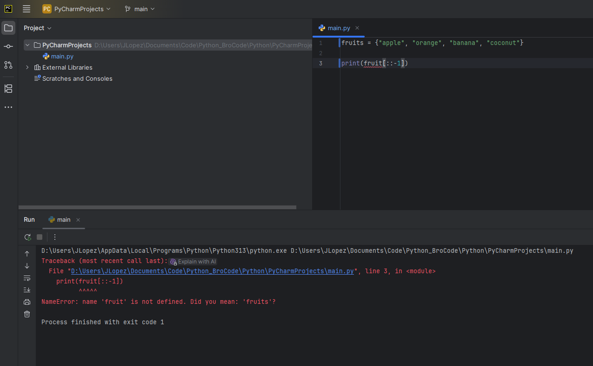
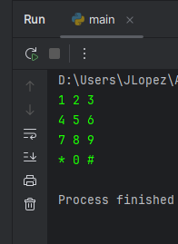

# Collection

Collection = single "variable" used to store multiple values

examples

1. Lists = [ ] ordered and changeable. Duplicates OK
2. Set = { } unordered and immutable, but Add/Remove OK. NO Duplicates
3. Tuple = ( ) ordered and unchangeable. Duplicates OK. FASTER

# 1. Lists
### if we print our list we get this:

    fruits = ["apple", "orange", "banana", "coconut"]

    print(fruits)

### if we want to access a given element from the list we need to do the following:

    fruits = ["apple", "orange", "banana", "coconut"]

    print(fruits[0])

### Other ways to print out the list using indexing

    fruits = ["apple", "orange", "banana", "coconut"]

    print(fruits[0:3])

    print(fruits[::-1])

    print(fruits[::2])

### Helpful functions to help with methods for lists

    fruits = ["apple", "orange", "banana", "coconut"]

    # the dir function gives a list of different methods for a list
    print(dir(fruits))

    # the help function gives a description of each method and how to use them
    print(help(fruits))

    for fruit in fruits:
        print(fruit, end=' ')

# 2. Sets

Same as a list. But each time you print out the order changes randomly. 

Uses curly braces { }

    fruits = {"apple", "orange", "banana", "coconut"}

    print(fruits)

1st print:

2nd print:

Not able to use indexing because collection is always changing

# Tuples

Same as lists but different

# 2 Dimensional

    # 2-D list

    num_pad = ((1,2,3),(4,5,6),(7,8,9),("*",0,"#"))

    for row in num_pad:
        for num in row:
            print(num,end= " ")
        print()

