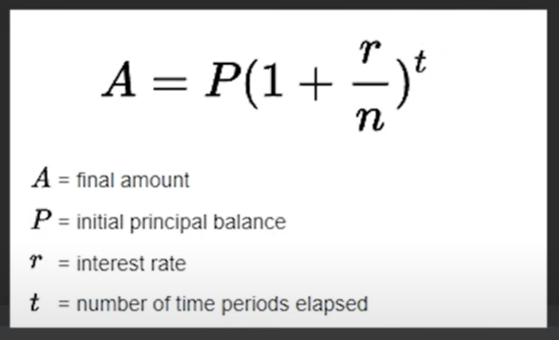
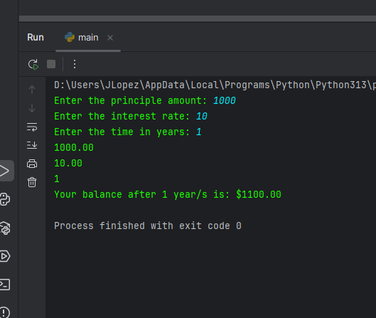
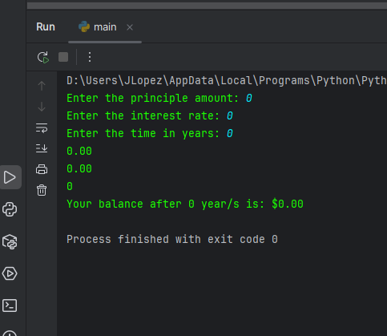

# Interest Calculator

### What is Interest?
Interest is the monetary charge for the privilege of borrowing money. Interest expense or revenue is often expressed as a dollar amount, while the interest rate used to calculate interest is typically expressed as an annual percentage rate (APR). Interest is the amount of money a lender or financial institution receives for lending out money. Interest can also refer to the amount of ownership a stockholder has in a company, usually expressed as a percentage. 

    Formula: A = P(1 + r/N)^t

    A = final amount
    P = initial principal balance
    r = interest rate
    t = number of time periods elapsed
    n = 100 (to get percentage)



```python
    principle = 0
    rate = 0
    time = 0

    while principle <= 0:
        principle = float(input("Enter the principle amount: "))
        if principle <= 0:
            print("Principle can't be less than or equal to zero")

    while rate <= 0:
        rate = float(input("Enter the interest rate: "))
        if rate <= 0:
            print("Interest rate can't be less than or equal to zero")

    while time <= 0:
        time = int(input("Enter the time in years: "))
        if time <= 0:
            print("Time can't be less than or equal to zero")

    print(f"{principle:.2f}")
    print(f"{rate:.2f}")
    print(f"{time}")

    total = principle * pow((1 + (rate/100)),time)
    print(f"Your balance after {time} year/s is: ${total:.2f}")
```

Output:



### Another example

Same program, but now user is allowed to enter 0's

```python
    principle = 0
    rate = 0
    time = 0

    while True:
        principle = float(input("Enter the principle amount: "))
        if principle < 0:
            print("Principle can't be less than or equal to zero")
        else:
            break

    while True:
        rate = float(input("Enter the interest rate: "))
        if rate < 0:
            print("Interest rate can't be less than or equal to zero")
        else:
            break

    while True:
        time = int(input("Enter the time in years: "))
        if time < 0:
            print("Time can't be less than or equal to zero")
        else:
            break

    print(f"{principle:.2f}")
    print(f"{rate:.2f}")
    print(f"{time}")

    total = principle * pow((1 + (rate/100)),time)
    print(f"Your balance after {time} year/s is: ${total:.2f}")
```

Output: 



