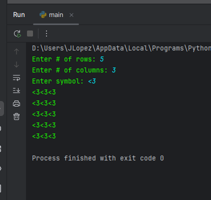

# For Loops

The for statement is used to iterate

# Nested loops

A loop within another loop (outer, inner)

    outer loop:
        inner loop:

### Example

    rows = int(input("Enter # of rows: "))
    columns = int(input("Enter # of columns: "))
    symbol = input("Enter symbol: ")

    for x in range(rows):
        for y in range(columns):
            print(symbol,end = "")
        print()

