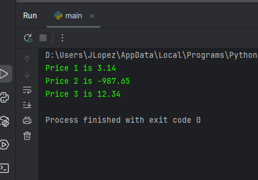
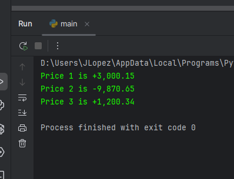

# Format specifiers

Format specifiers = {value:flags} format a value based on what flags are inserted

    .(number)f = round to that many decimal places (fixed point)
    :(number) = allocate that many spaces
    :03 = allocate and zero pad that many spaces
    :< = left justify
    :> = right justify
    :^ = center align
    :+ = use a plus sign to indicate a positive value
    := = place sign to leftmost position
    :  = inter a space before positive numbers
    :, = comma separator

## Example

    price1 = 3.14159
    price2 = -987.65
    price3 = 12.34

    print(f"Price 1 is {price1:.2f}")
    print(f"Price 2 is {price2:.2f}")
    print(f"Price 3 is {price3:.2f}")

## More examples

    price1 = 3000.1459
    price2 = -9870.65
    price3 = 1200.34

    print(f"Price 1 is {price1:+,.2f}")
    print(f"Price 2 is {price2:+,.2f}")
    print(f"Price 3 is {price3:+,.2f}")

