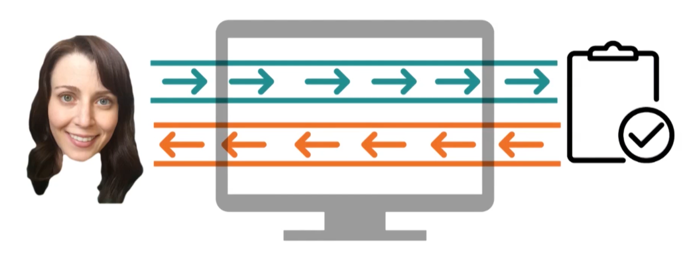

# Welcome

---

Uncharted territory to explore in Human Computer Interaction. 

Nothing replaces your users and getting their feedback.

## Humans

---
As a human we perceive the world like: seeing, feeling, and hearing. More like smelling and tasting

## Computers

---

## Interaction

---

We have humans and computers

We have tasks where a human interacts with a task and uses a computer as the medium. Basically a Human + Computer
are used to interact with a task. 

Trying to make the interface (computer) as invisible as possible

Why? We want the user to spend the most time dealing with task and not the interface

### "We might be experts at interacting with computers, but that doesn't make us experts at designing interactions between other humans and computers"

    