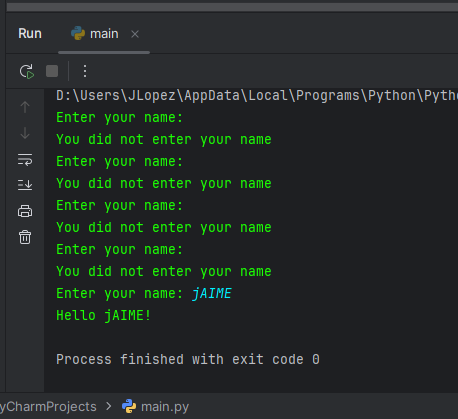
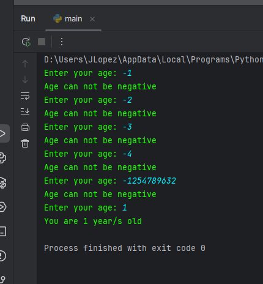
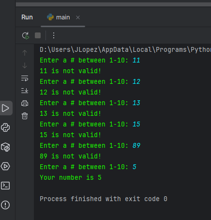

# While Loops

While loops execute some code WHILE some condition remains true

### Example

    name = input("Enter your name: ")

    while name == "":
        print("You did not enter your name")
        name = input("Enter your name: ")
    print(f"Hello {name}!")

This program will keep telling user to enter their name until some input from the user. Once an input is applied the program will greet the user + input.

### Another Example

    age = int(input("Enter your age: "))

    while age < 0:
        print("Age can not be negative")
        age = int(input("Enter your age: "))

    print(f"You are {age} year/s old")

### Last Example with logical operators

    num = int(input("Enter a # between 1-10: "))

    while num < 1 or num > 10:
        print(f"{num} is not valid!")
        num = int(input("Enter a # between 1-10: "))

    print(f"Your number is {num}")

