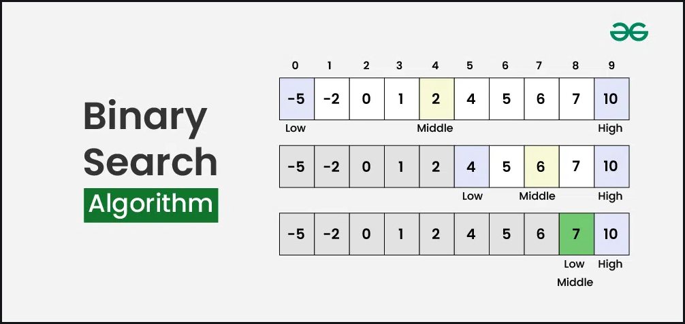
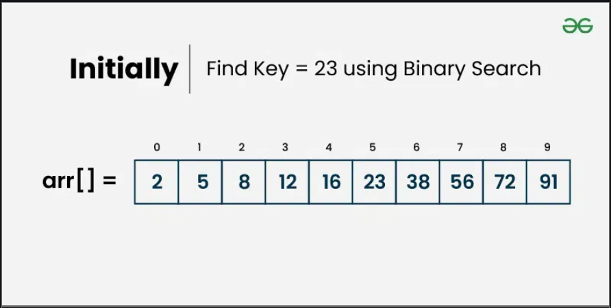
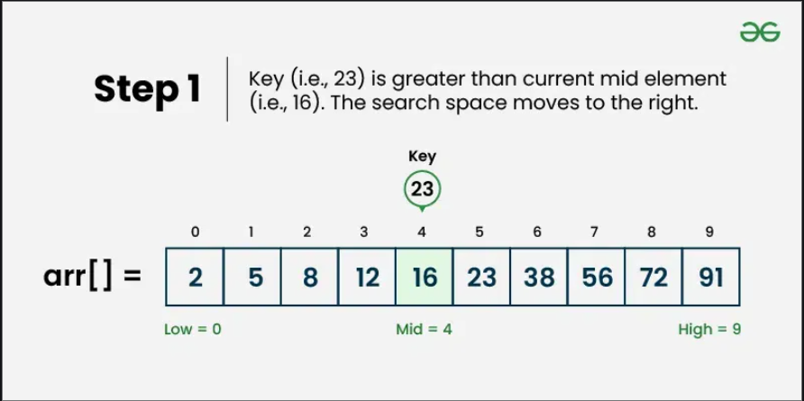
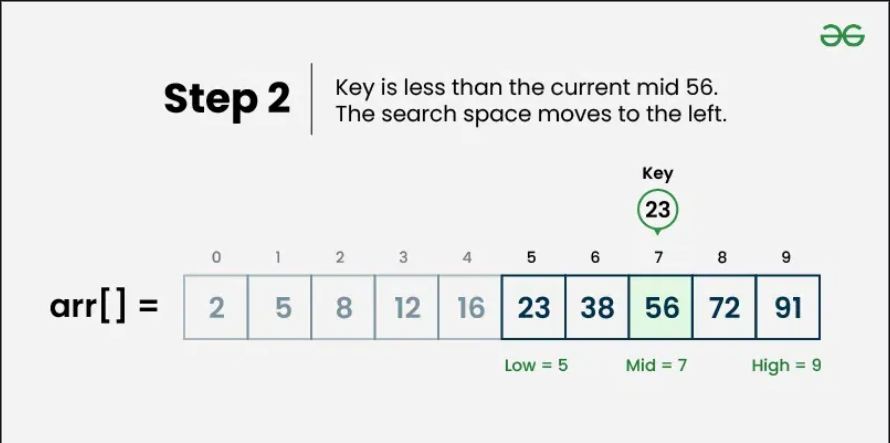
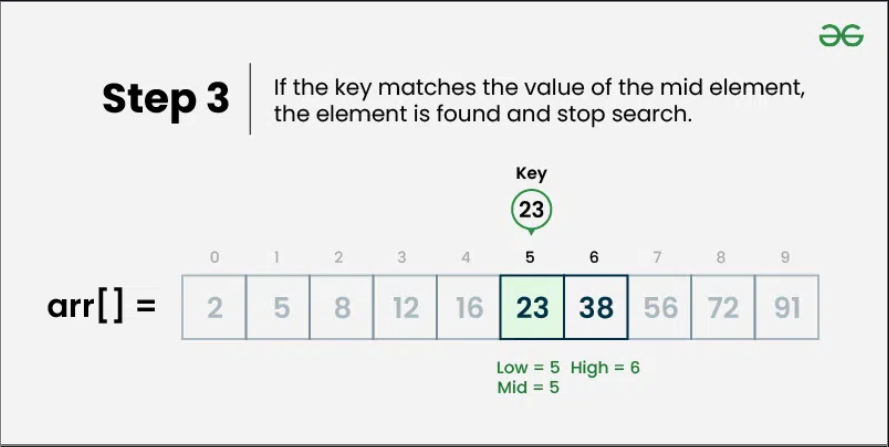

# Binary Search

---
Binary Search is a [searching algorithm](https://www.geeksforgeeks.org/dsa/searching-algorithms/) that operates on a sorted or monotonic search space, repeatedly dividing it into halves to find a target value or optimal answer in logarithmic time O(log N).



## Conditions to apply Binary Search Algorithm in a Data Structure

---
To apply Binary Search algorithm:

- The data structure must be sorted.
- Access to any element of the data structure should take constant time.

## Binary Search Algorithm

---
Below is the step-by-step algorithm for Binary Search:

- Divide the search space into two halves by finding the middle index "mid". 
- Compare the middle element of the search space with the key. 
- If the key is found at middle element, the process is terminated.
- If the key is not found at middle element, choose which half will be used as the next search space.
   - -> If the key is smaller than the middle element, then the left side is used for next search.
   - -> If the key is larger than the middle element, then the right side is used for next search.
- This process is continued until the key is found or the total search space is exhausted.

## How does Binary Search Algorithm work?
To understand the working of binary search, consider the following illustration:

Consider an array arr[] = {2, 5, 8, 12, 16, 23, 38, 56, 72, 91}, and the target = 23.

### Initially


### Step 1


### Step 2


### Step 3


## How to Implement Binary Search Algorith?

---
The Binary Search Algorithm can be implemented in the following two ways

- Iterative Binary Search Algorithm
- Recursive Binary Search Algorithm

## Iterative Binary Search Algorithm: O(log n) Time and O(1) Space

---
```python
def binarySearch(arr, x):
    low = 0
    high = len(arr) - 1
    while low <= high:

        mid = low + (high - low) // 2

        # Check if x is present at mid
        if arr[mid] == x:
            return mid

        # If x is greater, ignore left half
        elif arr[mid] < x:
            low = mid + 1

        # If x is smaller, ignore right half
        else:
            high = mid - 1

    # If we reach here, then the element
    # was not present
    return -1

if __name__ == '__main__':
    arr = [2, 3, 4, 10, 40]
    x = 10

    result = binarySearch(arr, x)
    if result != -1:
        print("Element is present at index", result)
    else:
        print("Element is not present in array")
```
#### Output
```
Element is present at index 3
```

## Recursive Binary Search Algorithm:

---
Create a recursive function and compare the mid of the search space with the key. And based on the result either return the index where the key is found or call the recursive function for the next search space.

```python
# A recursive binary search function. It returns
# location of x in given array arr[low..high] is present,
# otherwise -1
def binarySearch(arr, low, high, x):

    # Check base case
    if high >= low:

        mid = low + (high - low) // 2

        # If element is present at the middle itself
        if arr[mid] == x:
            return mid

        # If element is smaller than mid, then it
        # can only be present in left subarray
        elif arr[mid] > x:
            return binarySearch(arr, low, mid-1, x)

        # Else the element can only be present
        # in right subarray
        else:
            return binarySearch(arr, mid + 1, high, x)

    # Element is not present in the array
    else:
        return -1

if __name__ == '__main__':
    arr = [2, 3, 4, 10, 40]
    x = 10
    
    result = binarySearch(arr, 0, len(arr)-1, x)
    
    if result != -1:
        print("Element is present at index", result)
    else:
        print("Element is not present in array")
```
#### Output
```
Element is present at index 3
```

## Complexity Analysis of Binary Search Algorithm

---
- Time Complexity: 
    - -> Best Case: O(1)
    - -> Average Case: O(log N)
    -  -> Worst Case: O(log N)
- Auxiliary Space: O(1), If the recursive call stack is considered then the auxiliary space will be O(log N).

Please refer [Time and Space Complexity Analysis of Binary Search](https://www.geeksforgeeks.org/dsa/complexity-analysis-of-binary-search/) for more details.