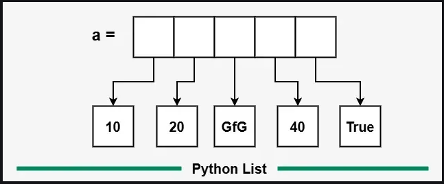

# Python Lists

---

In Python, a list is a built-in data structure that can hold an ordered collection of items. Unlike arrays in some languages, Python lists are very flexible:

- Can contain duplicate items
- Mutable: items can be modified, replaced, or removed
- Ordered: maintains the order in which items are added
- Index-based: items are accessed using their position (starting from 0)
- Can store mixed data types (integers, strings, booleans, even other lists)

## Creating a list
Lists can be created in several ways, such as using square brackets, the list() constructor or by repeating elements. Let's look at each method one by one with example:

1. #### Using Square Brackets
    We use square brackets [] to create a list directly.
```python
a = [1, 2, 3, 4, 5] # List of integers
b = ['apple', 'banana', 'cherry'] # List of strings
c = [1, 'hello', 3.14, True] # Mixed data types

print(a)
print(b)
print(c)
```
#### Output
```
[1, 2, 3, 4, 5]
['apple', 'banana', 'cherry']
[1, 'hello', 3.14, True]
```
2. #### Using list() Constructor

    We can also create a list by passing an iterable (like a tuple, string or another list) to the list() function.

```python
a = list((1, 2, 3, 'apple', 4.5))  
print(a)

b = list("GFG")
print(b)
```
#### Output
```
[1, 2, 3, 'apple', 4.5]
['G', 'F', 'G']
```

3. #### Creating List with Repeated Elements
We can use the multiplication operator * to create a list with repeated items.
```python
a = [2] * 5
b = [0] * 7

print(a)
print(b)
```
#### Output
```
[2, 2, 2, 2, 2]
[0, 0, 0, 0, 0, 0, 0]
```

## Accessing List Elements

---
Elements in a list are accessed using indexing. Python indexes start at 0, so a[0] gives the first element. Negative indexes allow access from the end (e.g., -1 gives the last element).
```python
a = [10, 20, 30, 40, 50]
print(a[0])    
print(a[-1])
print(a[1:4])   # elements from index 1 to 3
```
#### Output
```
10
50
[20, 30, 40]
```

## Adding Elements into List

---
We can add elements to a list using the following methods:
- [append()](https://www.geeksforgeeks.org/python/python-list-append-method/#): Adds an element at the end of the list.
- [extend()](https://www.geeksforgeeks.org/python/python-list-extend-method/): Adds multiple elements to the end of the list.
- [insert()](https://www.geeksforgeeks.org/python/python-list-insert/): Adds an element at a specific position.
- [clear()](https://www.geeksforgeeks.org/python/python-list-clear-method/): removes all items.

```python
a = []

a.append(10)  
print("After append(10):", a)  

a.insert(0, 5)
print("After insert(0, 5):", a) 

a.extend([15, 20, 25])  
print("After extend([15, 20, 25]):", a) 

a.clear()
print("After clear():", a)
```

#### Output
```
After append(10): [10]
After insert(0, 5): [5, 10]
After extend([15, 20, 25]): [5, 10, 15, 20, 25]
After clear(): []
```

## Updating Elements into List

---
Since lists are mutable, we can update elements by accessing them via their index.
```python
a = [10, 20, 30, 40, 50]
a[1] = 25 
print(a)
```
#### Output
```
[10, 25, 30, 40, 50]
```

## Removing Elements from List

---
We can remove elements from a list using:
- remove(): Removes the first occurrence of an element.
- pop(): Removes the element at a specific index or the last element if no index is specified.
- del statement: Deletes an element at a specified index.
```python
a = [10, 20, 30, 40, 50]

a.remove(30)  
print("After remove(30):", a)

popped_val = a.pop(1)  
print("Popped element:", popped_val)
print("After pop(1):", a) 

del a[0]  
print("After del a[0]:", a)
```
#### Output
```
After remove(30): [10, 20, 40, 50]
Popped element: 20
After pop(1): [10, 40, 50]
After del a[0]: [40, 50]
```

## Iterating Over Lists

---
We can iterate over lists using loops, which is useful for performing actions on each item.
```python
a = ['apple', 'banana', 'cherry']
for item in a:
    print(item)
```
#### Ouput
```
apple
banana
cherry
```

## Nested Lists

---
A nested list is a list within another list, which is useful for representing matrices or tables. We can access nested elements by chaining indexes.
```python
matrix = [ [1, 2, 3],
           [4, 5, 6],
           [7, 8, 9] ]
print(matrix[1][2])
```
#### Output
```
6
```

## List Comprehension

---
[List comprehension](https://www.geeksforgeeks.org/python/python-list-comprehension/) is a concise way to create lists using a single line of code. It is useful for applying an operation or filter to items in an iterable, such as a list or range.
```python
squares = [x**2 for x in range(1, 6)]
print(squares)
```
#### Output
```
[1, 4, 9, 16, 25]
```
#### Explanation
- for x in range(1, 6): loops through each number from 1 to 5 (excluding 6).
- x**2: squares each number x.
- []: collects all the squared numbers into a new list.

## How Python Stores List Elements?

---
In Python, a list doesn’t store actual values directly. Instead, it stores references (pointers) to objects in memory. This means numbers, strings and booleans are separate objects in memory and the list just keeps their addresses.

That’s why modifying a mutable element (like another list or dictionary) can change the original object, while immutables remain unaffected.

```python
a = [10, 20, "GfG", 40, True]
print(a)        
print(a[0])     
print(a[1])  
print(a[2])
```
#### Output
```
[10, 20, 'GfG', 40, True]
10
20
GfG
```

#### Explanation
- The list a contains an integer (10, 20 and 40), a string ("GfG") and a boolean (True).
- Elements are accessed using indexing (a[0], a[1], etc.).
- Each element keeps its original type.


