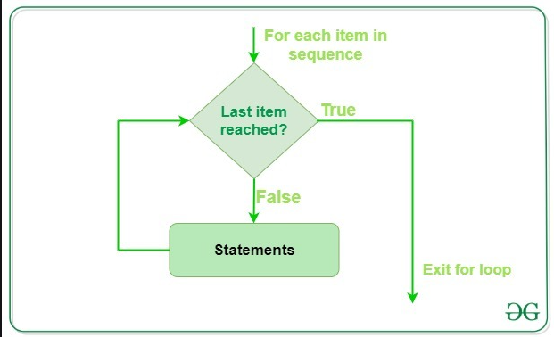

## For loops

---

Python for loops are used for iterating over sequences like lists, tuples, strings and ranges.

- A for loop allows you to apply the same operation to every item within the loop.
- Using a for loop avoids the need to manually manage the index.
- A for loop can iterate over any iterable object, such as a dictionary, list or custom iterator.

### For Loop Example:
```python
s = ["Geeks", "for", "Geeks"]

# using for loop with string
for i in s:
    print(i)
```

### Output:
```
Geeks
for
Geeks
```

### Flowchart of For Loop



### Python For Loop Syntax:

```python
for var in iterable:
    # statements
    pass
```

#### Note: In Python, for loops only implement the collection-based iteration.

### Python For Loop with String
This code uses a for loop to iterate over a [string](https://www.geeksforgeeks.org/python/python-string/) and print each character on a new line. The loop assigns each character to the variable i and continues until all characters in the string have been processed.

```python
s = "Geeks"
for i in s:
    print(i)
```

### Output

```
G
e
e
k
s
```
### Using range() with For Loop

The [range()](https://www.geeksforgeeks.org/python/python-range-function/) function is commonly used with for loops to generate a sequence of numbers. It can take one, two, or three arguments:

- range(stop): Generates numbers from 0 to stop-1.
- range(start, stop): Generates numbers from start to stop-1.
- range(start, stop, step): Generates numbers from start to stop-1, incrementing by step.

```python
for i in range(0, 10, 2):
    print(i)
```
### Output
```
0
2
4
6
8
```
