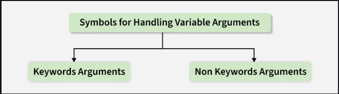

# *args and **kwargs in Python

---

In Python, *args and **kwargs are used to allow functions to accept an arbitrary number of arguments. These features provide great flexibility when designing functions that need to handle a varying number of inputs.

Below code shows how *args collects multiple positional arguments into a tuple and how **kwargs collects keyword arguments into a dictionary.

```python
# *args example
def fun(*args):
    return sum(args)

print(fun(5, 10, 15))   

# **kwargs example
def fun(**kwargs):
    for k, val in kwargs.items():
        print(k, val)

fun(a=1, b=2, c=3)
```
#### Output
```
30
a 1
b 2
c 3
```
## Symbols for Handling Variable Arguments

---
Python provides two special symbols for passing variable numbers of arguments:

 
- *args: Non-keyword (positional) arguments
- **kwargs: Keyword arguments

### Note: 
“We use the "wildcard" or "*" notation like this - *args OR **kwargs - as our function's argument when we have doubts about the number of  arguments we should pass in a function.” 

## 1. Non-Keyword Arguments (*args)

The special syntax *args allows us to pass any number of positional (non-keyword) arguments to a function. These arguments are collected into a tuple, which means we can loop through them or use them with built-in functions.

This is useful when you don’t know in advance how many values will be passed.

Below example shows how *args can collect multiple values and let us iterate through them.

```python
def myFun(*argv):
    for arg in argv:
        print(arg)

myFun('Hello', 'Welcome', 'to', 'GeeksforGeeks')
```
#### Output
```
Hello
Welcome
to
GeeksforGeeks
```
#### Explanation: 

- def myFun(*argv): defines a function that accepts any number of positional arguments.
- for arg in argv: loops through the tuple of arguments.

Here we use *args to multiply any number of values.
```python
def multiply(*args):
    result = 1
    for num in args:
        result *= num
    return result

print(multiply(2, 3, 4))
```

#### Output
```
24
```

#### Explanation:

- def multiply(*args): accepts multiple numbers as input.
- result = 1: initialize result to 1 (since we are multiplying).
- for num in args: loop through all arguments.
- result *= num: multiply each number with result.

## 2. Keyword Arguments

---
The special syntax **kwargs allows us to pass any number of keyword arguments (arguments in the form key=value). These arguments are collected into a dictionary, where:

- Keys = argument names
- Values = argument values

This is useful when you want your function to accept flexible, named inputs.

Below example shows how **kwargs stores arguments in a dictionary.
```python
def fun(**kwargs):
    for k, val in kwargs.items():
        print(k, "=", val)

fun(s1='Python', s2='is', s3='Awesome')
```

#### Output
```
s1 = Python
s2 = is
s3 = Awesome
```
#### Explanation

- def fun(**kwargs): defines a function that accepts any number of keyword arguments.
- kwargs.items(): returns key-value pairs from the dictionary.

Here we use **kwargs to create a formatted string from the arguments.
```python
def introduce(**kwargs):
    details = []
    for k, v in kwargs.items():
        details.append(k + ": " + str(v))
    return ", ".join(details)

print(introduce(Name="Alice", Age=25, City="New York"))
```
#### Output
```
Name: Alice, Age: 25, City: New York
```

#### Explanation

def introduce(**kwargs): accepts flexible keyword arguments.
for k, v in kwargs.items(): loop through each key-value pair.
details.append(k + ": " + str(v)): format each pair as key: value and add to list.
", ".join(details): join list items into a single string separated by commas.

## Using both *args and **kwargs

---
We can also combine *args and **kwargs in the same function. This way, the function can accept both positional and keyword arguments at once.

```python
def student_info(*args, **kwargs):
    print("Subjects:", args)        # Positional arguments
    print("Details:", kwargs)       # Keyword arguments

# Passing subjects as *args and details as **kwargs
student_info("Math", "Science", "English", Name="Alice", Age=20, City="New York")
```

#### Output
```
Subjects: ('Math', 'Science', 'English')
Details: {'Name': 'Alice', 'Age': 20, 'City': 'New York'}
```

#### Explanation:

- *args: collects positional arguments into a tuple.
- **kwargs: collects keyword arguments into a dictionary.