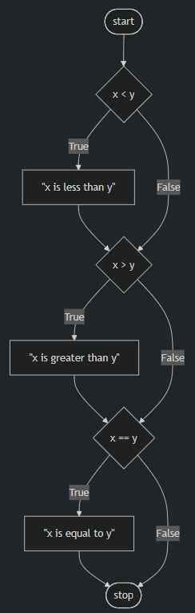
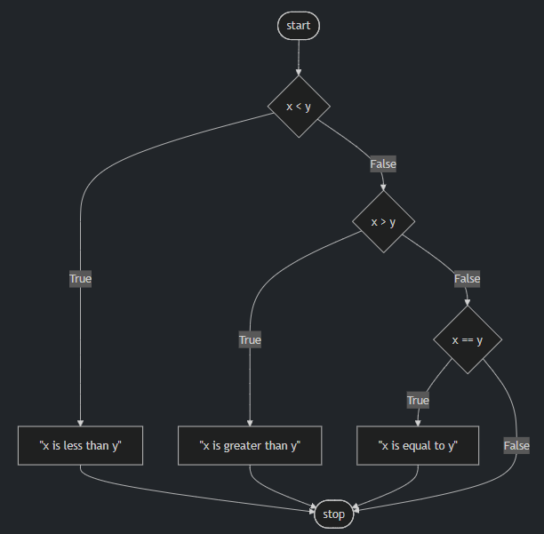
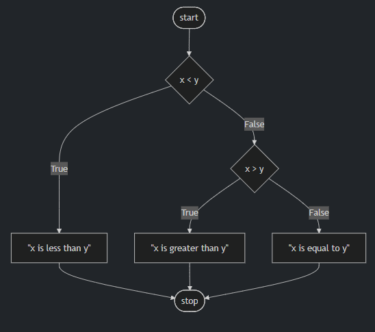

## Conditionals

- Conditionals allow you, the programmer, to allow your program to make decisions. As if your program has the choice between taking the left hand road or the right hand road based upon certain conditions.
- Conditionals allow your program to make decisions, choosing one path over another depending on specified conditions.
- Built within Python are a set of "operators" that are used to ask mathematical questions.

The `<` and `>` symbols are probably quite familiar to you.

- `>=` denotes "greater than or equal to."
- `<=` denotes "less than or equal to."
- `==` denotes "equals."  
  *(Note the double equal sign: a single equal sign assigns a value, whereas two equal signs compare values.)*
- `!=` denotes "not equal to."

- Conditional statements compare a left hand term to a right hand term.

## if Statements
- In your terminal window, type code compare.py. This will create a brand new file called “compare.”
- In the text editor window, begin with the following

```python
x = int(input("What's x? "))
y = int(input("What's y? "))
if x < y:
    print("x is less than y")
```
Notice how your program takes the input of the user for both x and y, casting them as integers and saving them into their respective x and y variables. Then, the if statement compares x and y. If the condition of x < y is met, the print statement is executed.

- `if` statements use bool (Boolean) values (True or False) to decide whether or not to execute code. If the comparison x > y is True, the interpreter runs the indented block.

## Control Flow, elif, and else

- Further revise your code as follows:

```python
x = int(input("What's x? "))
y = int(input("What's y? "))

if x < y:
    print("x is less than y")
if x > y:
    print("x is greater than y")
if x == y:
    print("x is equal to y")
```
Notice how you are providing a series of `if` statements. First, the first `if` statement is evaluated. Then, the second `if` statement runs its evaluation. Finally, the last `if` statement runs its evaluation. This flow of decisions is called “control flow.”

- Our code can be represented as follows:




- This program can be improved by not asking three consecutive questions. After all, not all three questions can have an outcome of `true`! Revise your program as follows:
```python
x = int(input("What's x? "))
y = int(input("What's y? "))

if x < y:
    print("x is less than y")
elif x > y:
    print("x is greater than y")
elif x == y:
    print("x is equal to y")
```

Notice how the use of `elif` allows the program to make fewer decisions. First, the `if` statement is evaluated. If this statement is found to be true, all the `elif` statements will not be run at all. However, if the `if` statement is evaluated and found to be false, the first `elif` will be evaluated. If this is true, it will not run the final evaluation.

- Our code can be represented as follows:



- While your computer may not notice a difference speed-wise between our first program and this revised program, consider how an online server running billions or trillions of these types of calculations each day could definitely be impacted by such a small coding decision.
- There is one final improvement we can make to our program. Notice how logically `elif x == y` is not a necessary evaluation to run. After all, if logically x is not less than y AND x is not greater than y, x MUST equal y. Therefore, we don’t have to run `elif x == y`. We can create a “catch-all,” default outcome using an `else` statement. We can revise as follows:

```python
x = int(input("What's x? "))
y = int(input("What's y? "))

if x < y:
    print("x is less than y")
elif x > y:
    print("x is greater than y")
else:
    print("x is equal to y")
```

Notice how the relative complexity of this program has decreased through our revision.

- Our code can be represented as follows:


