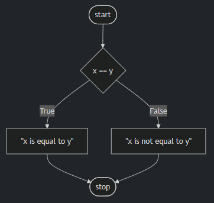

## Logical operators

-------------------------

## or

- `or` allows your program to decide between one or more alternatives. For example, we could further edit our program as follows:

```python
x = int(input("What's x? "))
y = int(input("What's y? "))

if x < y or x > y:
    print("x is not equal to y")
else:
    print("x is equal to y")
```

Notice that the result of our program is the same, but the complexity is decreased. The efficiency of our code is increased.
- At this point, our code is pretty great. However, could the design be further improved? We could further edit our code as follows:

```python
x = int(input("What's x? "))
y = int(input("What's y? "))

if x != y:
    print("x is not equal to y")
else:
    print("x is equal to y")
```

Notice how we removed the `or` entirely and simply asked, "Is x not equal to y?" We ask one any only one question. Very efficient!

- for the purpose of illustration, we could also change our code as follows: 
```python
x = int(input("What's x? "))
y = int(input("What's y? "))

if x == y:
    print("x is equal to y")
else:
    print("x is not equal to y")
```
Notice that the `==` operator evaluates if what is on the left and right are equal to one another. The use of double equal signs is very important. If you use only one equal sign, an error will likely be thrown by the interpreter.

- Our code can be illustrated as follows:



------------------------------------------------------------------------------------------------------------------------

## and

- Similar to or, and can be used within conditional statements.
- Execute in the terminal window code grade.py. Start your new program as follows:

```python
score = int(input("Score: "))

if score >= 90 and score <= 100:
    print("Grade: A")
elif score >=80 and score < 90:
    print("Grade: B")
elif score >=70 and score < 80:
    print("Grade: C")
elif score >=60 and score < 70:
    print("Grade: D")
else:
    print("Grade: F")
```
Notice that by executing `python grade.py`, you will be able to input a score and get a grade. However, notice how there is potential for bugs.

- Typically, we do not want to ever trust our users to input the correct information. We could improve our code as follows:

```python
  score = int(input("Score: "))

  if 90 <= score <= 100:
      print("Grade: A")
  elif 80 <= score < 90:
      print("Grade: B")
  elif 70 <= score < 80:
      print("Grade: C")
  elif 60 <= score < 70:
      print("Grade: D")
  else:
      print("Grade: F")
```

Notice how Python allows you to chain together the operators and conditions in a way quite uncommon to other programming languages.

- Still, we can further improve our program:

```python
score = int(input("Score: "))

if score >= 90:
    print("Grade: A")
elif score >= 80:
    print("Grade: B")
elif score >= 70:
    print("Grade: C")
elif score >= 60:
    print("Grade: D")
else:
    print("Grade: F")
```

Notice how the program is improved by asking fewer questions. This makes our program easier to read and far more maintainable in the future.

- You can learn more in Python’s documentation on control flow.