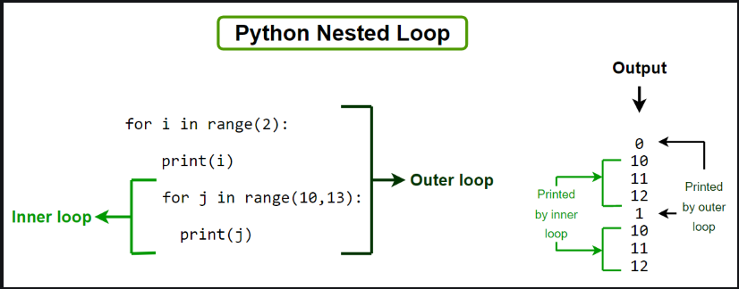

## Python Nested Loops

In [Python programming language](https://www.geeksforgeeks.org/python/python-programming-language-tutorial/) there are two types of loops which are [for loop](https://www.geeksforgeeks.org/python/python-for-loops/) and [while loop](https://www.geeksforgeeks.org/python/python-while-loop/). Using these loops we can create nested loops in Python. Nested loops mean loops inside a loop. For example, while loop inside the for loop, for loop inside the for loop, etc.



### Python Nested Loops Syntax:
```
Outer_loop Expression:
    Inner_loop Expression:
        Statement inside inner_loop
    Statement inside Outer_loop
```

### Python Nested Loops Example

#### Example 1: Basic Example of Python Nested Loops

```python
x = [1, 2]
y = [4, 5]

for i in x:
  for j in y:
    print(i, j)
```
#### Output
```
1 4
1 5
2 4
2 5
```

```python
x = [1, 2]
y = [4, 5]
i = 0
while i < len(x) :
  j = 0
  while j < len(y) :
    print(x[i] , y[j])
    j = j + 1
  i = i + 1
```
Time Complexity: 0(n$^{2}$)


