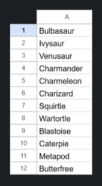
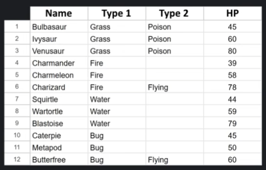
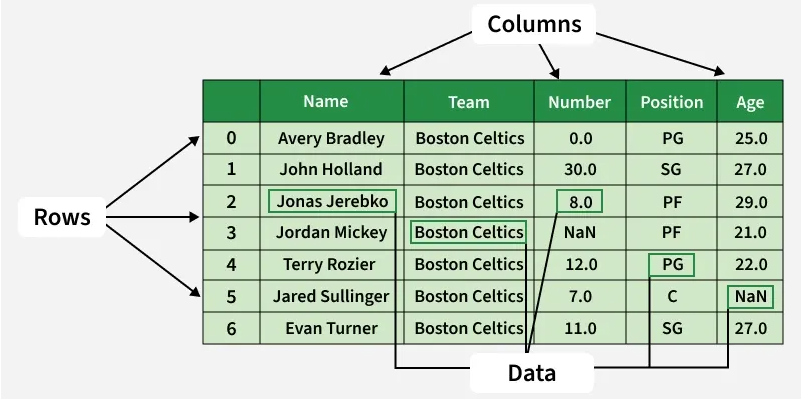
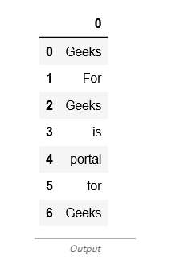

# Pandas

---
It's a python library. 
Built on top of Numpy

### What fields is it used in?

- Data Analysis
- Data Science
- Machine Learning

Pandas comes from Panel Data

Panda ≠ 

### Series vs DataFrames

---

With this library you work with objects:
- Series
  - A series is a one-dimensional labeled column
  - 
- DataFrames
  - A dataframe is a two-dimensional labeled grid or table
  - 

With this library you can:
- Import
- Display
- Manipulate
- Export

### Pandas DataFrame

---
A Pandas DataFrame is a two-dimensional table-like structure in Python where data is arranged in rows and columns. It’s one of the most commonly used tools for handling data and makes it easy to organize, analyze and manipulate data. It can store different types of data such as numbers, text and dates across its columns. The main parts of a DataFrame are:
- Data: Actual values in the table
- Rows: Labels that identify each row.
- Columns: Labels that define each data category.

In this article, we’ll see the key components of a DataFrame and see how to work with it to make data analysis easier and more efficient.



### Creating a Pandas DataFrame

---
Pandas allows us to create a DataFrame from many data sources. We can create DataFrames directly from Python objects like lists and dictionaries or by reading data from external files like CSV, Excel or SQL databases.

Here are some ways by which we create a dataframe:

#### 1. Creating a DataFrame using a list

If we have a simple list of data, we can easily create a DataFrame by passing that list to the pd.DataFrame() function.

```python
import pandas as pd
 
lst = ['Geeks', 'For', 'Geeks', 'is', 
            'portal', 'for', 'Geeks']

df = pd.DataFrame(lst)
print(df)
```
#### Output:



#### 2. Creating DataFrame from dict