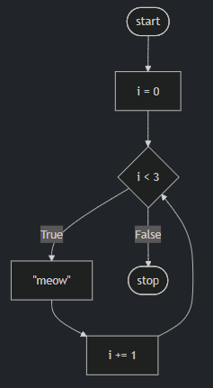

## Loops

-----
- Essentially, loops are a way to do something over and over again.
- Begin by typing `code cat.py` in the terminal window.
- In the text editor, begin with the following code:

```python
print("meow")
print("meow")
print("meow")
```

Running this code by typing python cat.py, you’ll notice that the program meows three times.

- In developing as a programmer, you want to consider how one could improve areas of one’s code where one types the same thing over and over again. Imagine where one might want to “meow” 500 times. Would it be logical to type that same expression of print("meow") over and over again?
- Loops enable you to create a block of code that executes over and over again.

## While Loops

-----

- The `while` loop is nearly universal throughout all coding languages.
- Such a loop will repeat a block of code over and over again.
- In the text editor window, edit your code as follows:
```python
i = 3
while i != 0:
    print("meow")
```
Notice how even though this code will execute `print("meow")` multiple times, it will never stop! It will loop forever. `while` loops work by repeatedly asking if the condition of the loop has been fulfilled. In this case, the interpreter is asking, “does `i` not equal zero?” When you get stuck in a loop that executes forever, you can press `Ctrl+C` on your keyboard to break out of the loop.

- To fix this loop that lasts forever, we can edit our code as follows
```python
i = 3
while i != 0:
  print("meow")
  i = i - 1
```
Notice that now our code executes properly, reducing `i` by `1` for each “iteration” through the loop. The term iteration has special significance within coding. By iteration, we mean one cycle through the loop. The first iteration is the “0th” iteration through the loop. The second is the “1st” iteration. In programming, we count starting with 0, then 1, then 2.

- We can further improve our code as follows:
```python
  i = 1
  while i <= 3:
      print("meow")
      i = i + 1
```

Notice that when we code `i = i + 1` we assign the value of `i` from the right to the left. Above, we are starting `i` at one, like most humans count (1, 2, 3). If you execute the code above, you’ll see it meows three times. It’s best practice in programming to begin counting with zero.

- We can improve our code to start counting with zero:
```python
i = 0
while i < 3:
    print("meow")
    i += 1
```
Notice how changing the operator to `i < 3` allows our code to function as intended. We begin by counting with 0 and it iterates through our loop three times, producing three meows. Also, notice how `i += 1` is the same as saying `i = i + 1`.

Our code at this point is illustrated as follows:



Notice how our loop counts i up to, but not through `3`.